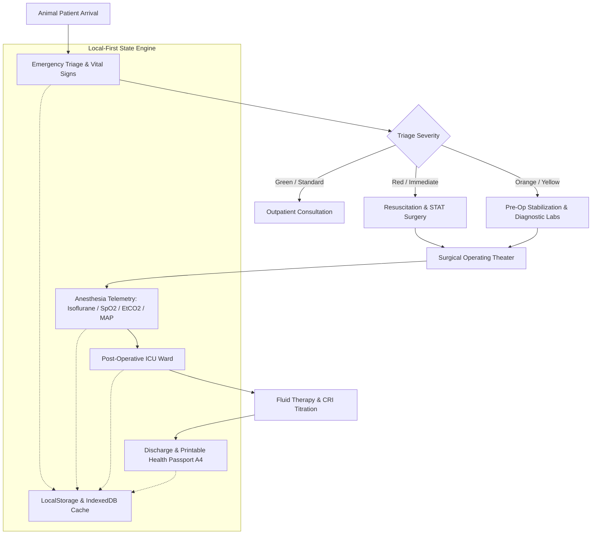

# 🐾 VetHospital OS — Veterinary Hospital EHR, Emergency Triage & Surgical Anesthesia Suite

<p align="center">
  
  
  
  
  
  
  
  
</p>

> 🚀 **Live Production Application:** [https://olyxmintabansos-byte.github.io/vethospital-os/](https://olyxmintabansos-byte.github.io/vethospital-os/)

---

### 🌐 System Overview & Vision

**VetHospital OS (Titan #35)** adalah sistem rekam medis elektronik hewan (*Veterinary Electronic Health Record / EHR*), triase gawat darurat klinis, dan suite pemantauan anestesi bedah operasional (*Surgical Anesthesia Operating Theater*) terpadu untuk rumah sakit hewan rujukan, klinik bedah spesialis, dan pusat perawatan satwa eksotis.

Dibangun dengan arsitektur **Client-Side Local-First**, VetHospital OS menyatukan triase pasien multi-spesies (anjing, kucing, kuda, reptil/burung eksotis), telemetri instrumen anestesi inhalasi real-time, monitoring ICU berkesinambungan, dan penerbitan paspor kesehatan & sertifikat medis format A4 tanpa ketergantungan server runtime atau latensi jaringan.

---

### 🎨 Design System: #22 Claymorphism (Friendly 3D Tactile Pills)

VetHospital OS mengimplementasikan bahasa desain **#22 Claymorphism**:
- **Filosofi Visual**: Menggabungkan suasana klinis veteriner yang ramah (*approachable*) dengan presisi medis tinggi. Kartu dan tombol tampak seperti tanah liat lembut (*soft clay*) 3D dengan kontur kapsul pil melengkung (`rounded-3xl` & `rounded-full`).
- **Dual Clay Shadows**:
  - **Clay Card**: Bayangan ganda dengan inner highlight terang dan outer shadow lembut:  
    `shadow-[inset_-3px_-3px_6px_rgba(0,0,0,0.06),_inset_3px_3px_6px_rgba(255,255,255,0.9),_8px_8px_20px_rgba(0,0,0,0.04)]`
  - **Tactile Pill Button**: Kapsul interaktif dengan sensasi kedalaman sentuhan fisik:  
    `shadow-[inset_-2px_-2px_4px_rgba(0,0,0,0.1),_inset_2px_2px_4px_rgba(255,255,255,0.8),_4px_4px_10px_rgba(0,0,0,0.06)]`
- **Pastel Clinical Canvas**:
  - Latar Kanvas Lembut: `#F4F6F8`
  - Sage Teal (Klinis Ramah): `#68B0AB`
  - Warm Lavender (Anestesi & Sedasi): `#9B86BD`
  - Peach Soft (Vitalitas & Suhu): `#F3A683`
  - Muted Sky (Oksigenasi SpO2): `#74B9FF`

---

### 🌟 Key Functional Pillars

#### 1. 🏥 Emergency Patient Admission & Multi-Species Triage (`/`)
- **Multi-Species Clinical Coverage**: Penanganan terpisah untuk *Canine* (Anjing), *Feline* (Kucing), *Equine* (Kuda), dan *Avian & Exotic* (Burung, Reptil, Mamalia Kecil).
- **Standardized Veterinary Triage**:
  - 🔴 **Red (Resuscitation)**: Gagal napas akut, henti jantung, syok anafilaktik (Evaluasi 0 menit).
  - 🟠 **Orange (Very Urgent)**: Trauma benturan, perdarahan hebat, kejang berulang (< 15 menit).
  - 🟡 **Yellow (Urgent)**: Dehidrasi berat, muntah terus-menerus, fraktur tulang (< 60 menit).
  - 🟢 **Green (Standard)**: Pemeriksaan rutin, vaksinasi, keluhan dermatologi ringan (< 120 menit).
- **Glasgow Pain Scale & Vitals**: Pencatatan Heart Rate (BPM), Respiratory Rate (BrPM), Rectal Temperature (°C), Capillary Refill Time (CRT detik), dan skor nyeri komposit.

#### 2. 💉 Surgical Operating Theater & Anesthesia Telemetry (`/surgery`)
- **Vaporizer Inhalation Telemetry**: Pengaturan presisi konsentrasi agen anestesi inhalasi (*Isoflurane* vs *Sevoflurane*) dan laju aliran gas oksigen murni (O2 Flow Rate L/min).
- **Real-Time Multiparameter Monitor**:
  - Oksigenasi: SpO2 (%) & Gelombang Pletismograf.
  - Ventilasi: Capnography End-Tidal CO2 (EtCO2 mmHg).
  - Hemodinamik: Tekanan Darah Invasif/Non-Invasif (Systolic, Diastolic, Mean Arterial Pressure / MAP mmHg).
  - Termoregulasi: Suhu inti tubuh intraoperatif (°C) dengan deteksi hipotermia bedah.
- **Anesthesia Depth Index**: Klasifikasi otomatis kedalaman anestesi (*Light*, *Optimal Surgical Plane*, *Deep Danger Warning*).

#### 3. 🛌 ICU Hospitalization & Critical Care Fluid Therapy (`/icu`)
- **Fluid Infusion Rate Calculator**: Kalkulasi kebutuhan cairan rumatan (*maintenance*), defisit dehidrasi, dan *ongoing losses* per bobot badan (ml/kg/jam).
- **Constant Rate Infusion (CRI)**: Penghitungan mikro-dosis obat analgesia berkelanjutan (Fentanyl, Ketamine, Lidocaine - FLK protocol).

#### 4. 📄 Discharge Summary & Printable Medical Passport A4 (`/discharge`)
- **Digital Health Passport**: Ekspor dokumen rekam medis resmi hewan peliharaan siap print/PDF format A4 standar klinik veteriner.
- **Resep & Instruksi Pasca Bedah**: Rincian obat oral bawa pulang, larangan aktivitas fisik, jadwal lepas jahitan, dan sertifikasi dokter hewan berwenang (*Veterinary License Stamp*).

---

### 🏗️ Architecture & Clinical Telemetry Flow



---

### 📁 Planned Directory Layout

```
vethospital-os/
├── public/
│   └── .nojekyll                 # Jekyll bypass for GitHub Pages
├── src/
│   ├── app/
│   │   ├── discharge/page.tsx    # Discharge summary & A4 medical passport
│   │   ├── icu/page.tsx          # ICU hospitalization & fluid infusion therapy
│   │   ├── surgery/page.tsx      # Surgical operating theater & anesthesia telemetry
│   │   ├── layout.tsx            # Global layout with Claymorphism 3D styling
│   │   └── page.tsx              # Emergency patient admission & multi-species triage
│   ├── components/               # Tactile clay cards, dials, vitals badges & modals
│   ├── context/
│   │   └── VetHospitalContext.tsx# Reactive state machine for patient records & anesthesia
│   └── types/
│       └── vet.ts                # Animal species, triage protocols & surgery schema
├── next.config.ts                # Static export configuration
└── package.json                  # Dependencies & scripts
```

---

### 🛠️ Technology Stack

| Domain | Technology / Library | Rationale |
|---|---|---|
| **Framework** | Next.js 16.3 (App Router) | High-speed static generation for offline-ready veterinary emergency rooms |
| **Language** | TypeScript (Strict Mode) | Zero-defect dosage calculations and animal biometric schema models |
| **Styling** | Tailwind CSS v4 | CSS-first zero-runtime utility styling with Claymorphism dual shadows |
| **Icons & UI** | Lucide React | Gentle, friendly veterinary and medical iconography |
| **Celebration FX** | Canvas-Confetti | Interactive positive reinforcement on patient discharge |
| **Persistence** | Local-First Storage | Complete client data sovereignty without hospital cloud subscription fees |
| **Deployment** | GitHub Pages (`gh-pages`) | Static hosting with `.nojekyll` bypass |

---

### 🚀 Getting Started & Local Development

Clone repositori dan jalankan pada local development environment:

```bash
# 1. Clone repository
git clone https://github.com/olyxmintabansos-byte/vethospital-os.git
cd vethospital-os

# 2. Install dependencies
npm install

# 3. Jalankan development server
npm run dev
```

Buka [http://localhost:3000](http://localhost:3000) pada browser Anda.

#### Build & Static Export

```bash
# Build static export ke direktori out/
npm run build

# Deploy langsung ke GitHub Pages branch gh-pages
npx --yes gh-pages -d out -b gh-pages --dotfiles
```

---

### 📄 License & Attribution

Didistribusikan di bawah lisensi MIT. Silakan gunakan untuk rumah sakit hewan, klinik veteriner, perlindungan satwa, maupun riset medis.

<p align="center">
  
  
</p>

<p align="center">
  <strong>© 2026 by Olyx (@olyxmintabansos-byte)</strong> • All rights reserved.
</p>
